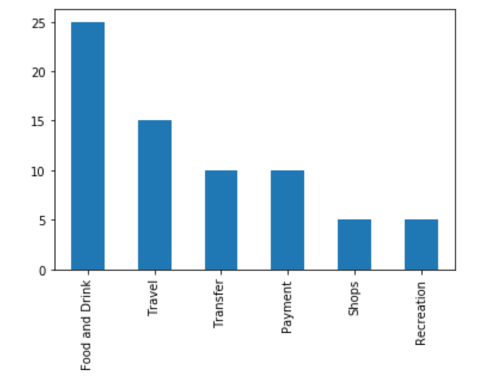
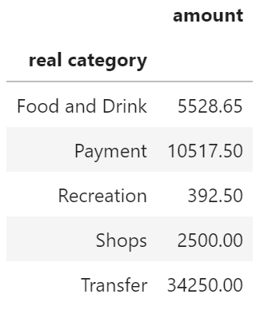

# Budget Analysis 
The client's 5 most recent transactions can be seen in the chart below. 

a breakdown of the client's total transactions can be seen in the pie chart below. Client's most frequent transactions broken down by category is Food and Drink. 

to further visualise the transaction count, there is a bar chart that orders the frequency of transactions.

lastly, here is the breakdown of the amount spent broken down by category. As shown below, the client has spent most of their money on transfers. 

lastly here is a line chart that shows that month over month spending is increasing.

